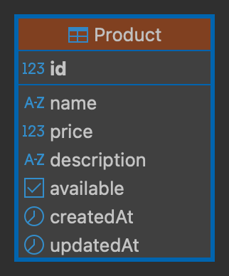

# Products Microservice

Microservicio responsable de la gestión del catálogo de productos y validación de su existencia/stock.

## Características Implementadas
- **Base de Datos PostgreSQL**: Uso de Prisma ORM para el modelo de productos.
- **Endpoints TCP Privados**: La comunicación se realiza de forma exclusiva por TCP, lo que incrementa el ancho de banda y la velocidad en la red interna comparado con HTTP.
- **Seed de Datos / Inicialización**: Incluye rutinas para poblar la base de datos con un catálogo inicial (en caso de utilizar SQLite/desarrollo o migraciones nuevas).
- **Validación Robusta**: Implementación de DTOs para evitar parámetros inválidos en las listas enviadas (como validar que el array de IDs de productos sea numérico y válido).

## Diagrama Entidad-Relación (ER)
Modelo enfocado únicamente en los Productos para respetar las fronteras del dominio:


## Instalación
1. Clonar repositorio
2. Instalar dependencias: `npm install`
3. Crear archivo `.env` basado en `env.template`
4. Ejecutar migración de prisma: `npx prisma migrate dev`
5. Insertar datos iniciales (seed): `npm run db:seed`
6. Ejecutar el proyecto: `npm run start:dev`


## Instantiate Postgres Database
```bash
docker compose up -d
```